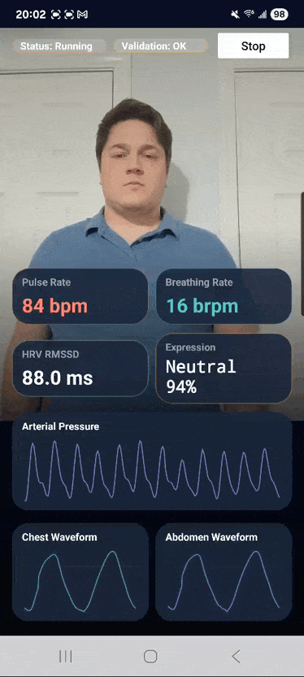
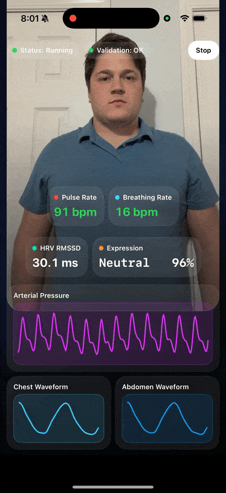

# SmartSpectra SDK

This repository hosts SmartSpectra SDK from PresageTech for measuring vitals such as pulse, breathing, and more using a camera. The SDK supports multiple platforms, including Android, iOS, and C++ for Windows, Mac, and Linux.

## Table of Contents

- [SmartSpectra SDK](#smartspectra-sdk)
  - [Getting Started](#getting-started)
  - [Build with an AI Assistant](#build-with-an-ai-assistant)
  - [Features](#features)
  - [Model Cards and Limitations](#model-cards-and-limitations)
  - [Telemetry and Privacy](#telemetry-and-privacy)
  - [Authentication](#authentication)
  - [Platform-Specific Guides](#platform-specific-guides)
    - [Android](#android)
    - [iOS](#ios)
    - [Windows / Mac / Linux (C++)](#windows--mac--linux-c)
  - [Bugs & Troubleshooting](#bugs--troubleshooting)

## Getting Started

To get started, follow the instructions for one of our currently supported platforms. Each platform has its own integration guide and example applications to help you get up and running quickly.
Documentation is available at <https://smartspectra.presagetech.com/>.

## Build with an AI Assistant

This repo ships `using-smartspectra`, an [Agent Skill](https://agentskills.io) that teaches an AI coding assistant how to build apps with the SDK. The same skill works in both Claude Code and OpenAI Codex:

- **Claude Code:** `/plugin marketplace add Presage-Security/SmartSpectra`, then `/plugin install smartspectra-sdk@smartspectra`
- **Codex:** `$skill-installer Presage-Security/SmartSpectra/.agents/skills/using-smartspectra`

Then ask your assistant to build with SmartSpectra. Full guide: [docs/agent-skill.md](docs/agent-skill.md).

Presage also hosts an MCP (Model Context Protocol) server at `https://mcp.presagetech.com/mcp`. Connect it and your assistant can work with your developer account directly — fetch or rotate your API key, register an iOS or Android app ID, download its OAuth config file, and check your plan and credits. Setup: [docs/mcp-server.md](docs/mcp-server.md).

## Features

- **Cardiac Waveform**  
  Real-time pulse pleth waveform supporting calculation of pulse rate and heart rate variability.

- **Breathing Waveform**  
  Real-time breathing waveform supporting biofeedback and breathing rate.

- **Myofacial Analysis**  
  Supporting face-point analysis, iris tracking, blinking detection, talking detection, and facial expression classification.

- **Relative Blood Pressure Waveform**  
  Relative blood pressure waveform shape.

- **Integrated Quality Control**  
  Confidence and stability metrics providing insight into the confidence in the signal. User feedback on imaging conditions to support successful use.

- **Camera Selection**  
  Front or rear facing camera selection on iOS or Android and specification of camera input for applications using the C++ SDK.

- **LLM Insights**  
  Turn the vitals the SDK computes on-device into natural-language analysis from a large language model, on request. See the [LLM Insights overview](docs/llm-insights/index.md).

## Model Cards and Limitations

Model cards include:

- Relative arterial pressure waveform
- Heart rate variability
- Pulse rate
- Face analysis
- Breathing rate
- Upper and lower breathing waveforms

Review the [SmartSpectra model cards and limitations](docs/model-cards-and-limitations.md) for metric-specific operating ranges, validation notes, and known limitations.

## Telemetry and Privacy

The SDK can report a small, aggregate, per-session diagnostic summary so we can measure release quality across the devices and conditions the SDK runs on. It is aggregate-only — no raw video, no measured vitals values, no user or device identifiers — and it is opt-out. See [SDK Telemetry & Privacy](docs/telemetry-and-privacy.md) for exactly what is and isn't collected and how to disable it.

## Authentication

- We support API key authentication for C++, iOS, and Android. We also support OAuth authentication for iOS and Android. See the platform-specific guides for setup instructions.
- Either path can be set up by an AI assistant instead of by hand — see [docs/mcp-server.md](docs/mcp-server.md).

## Platform-Specific Guides

### Android

For Android integration, refer to the [Android README](android/README.md). The guide includes:

- Prerequisites and setup instructions.
- Maven setup for stable releases, release candidates, and snapshots.
- Integration steps for your app.
- Example usage and troubleshooting tips.

### iOS

For iOS integration, refer to the [iOS README](swift/README.md). The guide includes:

- Prerequisites and setup instructions.
- Integration steps for your app using Swift Package Manager.
- Example usage and troubleshooting tips.

### Windows / Mac / Linux (C++)

For C++ integration on Windows, macOS, and Linux, refer to the [C++ README](cpp/README.md). The guide includes:

- Supported systems and architectures.
- Installation via the prebuilt ZIP (Windows), Homebrew (macOS), or apt (Linux).
- Build instructions and example applications.
- A Linux redistribution path for bundling the published SDK tarball into your
  own `.deb`: [Redistribute SmartSpectra on Linux](docs/redistribute_smartspectra_on_linux.md).

## Bugs & Troubleshooting

For additional support, contact <support@presagetech.com> or [submit a GitHub issue](https://github.com/Presage-Security/SmartSpectra/issues).
