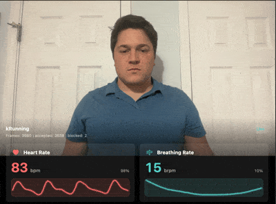

# SmartSpectra C++ Quickstart — Ubuntu 24.04 / Mint 22

> **Warning — Experimental platform:** Linux support for the SmartSpectra C++
> SDK is experimental. If you have any issues running SmartSpectra,
> [contact Presage support](mailto:support@presagetech.com) for assistance.

This guide covers the `noble` apt suite, which supports both `amd64` and
`arm64`. If you are on Ubuntu 22.04 / Mint 21, follow the
[Ubuntu 22.04 / Mint 21 guide](ubuntu-22-04.md) instead.

## Installation

### Prerequisites

- **CMake 3.22.1 or later** (the version shipped with Ubuntu 24.04 / Mint 22 is sufficient)
- **C++20 compiler** such as GCC or Clang
- **Vulkan-capable graphics driver** — Linux builds use Vulkan inference by default. The SDK package installs the Vulkan loader dependency through apt, but the host must provide a working Vulkan driver.
- **`cmake`, `curl`, `gpg`, and `pkg-config`** — used by the build, install, and verify steps below. Install with `sudo apt install cmake curl gpg pkg-config` if they are not already present.
- **API key** from [physiology.presagetech.com](https://physiology.presagetech.com/auth/login)

### Add the SDK

Install the Presage signing key:

```bash
sudo install -d -m 0755 /etc/apt/keyrings
curl -fsSL https://packages.presagetech.com/KEY.gpg \
  | sudo gpg --dearmor -o /etc/apt/keyrings/presage-archive-keyring.gpg
sudo chmod 644 /etc/apt/keyrings/presage-archive-keyring.gpg
```

Add the `noble` apt source:

```bash
echo "deb [signed-by=/etc/apt/keyrings/presage-archive-keyring.gpg] https://packages.presagetech.com/apt/ubuntu noble main" \
  | sudo tee /etc/apt/sources.list.d/presage-technologies.list
```

> **Installing an RC build?** Keep the same signing-key setup, but use the
> `noble-rc` apt source instead of `noble`:
>
> ```bash
> echo "deb [signed-by=/etc/apt/keyrings/presage-archive-keyring.gpg] https://packages.presagetech.com/apt/ubuntu noble-rc main" \
>   | sudo tee /etc/apt/sources.list.d/presage-technologies.list
> ```
>
> Then run the same `sudo apt update` and
> `sudo apt install libsmartspectra-dev` commands below.

Install the SDK:

```bash
sudo apt update
sudo apt install libsmartspectra-dev
```

The `signed-by=` source entry scopes the Presage signing key to the Presage
apt repository. APT selects the package matching your system's
`dpkg --print-architecture` (`amd64` or `arm64`) automatically.

The SmartSpectra SDK package is self-contained. You do not need to install
protobuf, curl, OpenSSL, or other SDK runtime libraries separately.

Verify that the package is visible to build tools:

```bash
pkg-config --modversion SmartSpectra
```

The command prints the installed SDK version (for example, `3.3.0`). If it
prints nothing or reports that the package is missing, reinstall
`libsmartspectra-dev` and confirm you are on a supported Ubuntu 24.04 /
Mint 22 (`amd64` or `arm64`) host.

## Example

This quick start creates a minimal CMake project that links against the
installed `SmartSpectra::SDK` package and reads from the default camera.

You will create exactly these files:

1. `hello_vitals/hello_vitals.cpp`
2. `hello_vitals/CMakeLists.txt`

### Result you should get

At the end, the app should show console output with:

- a successful CMake configure and build
- `Processing... Press Ctrl+C to stop.`
- `Cardio metrics:` log lines when cardio metrics are available
- `Breathing metrics:` log lines when breathing metrics are available
- a clean exit after you stop the sample



### Step 1 - Get an API key

1. Open the Presage [Developer Admin Portal Registration](https://physiology.presagetech.com/auth/register).
2. Register or log in.
3. Copy your API key from the portal.

### Step 2 - Create the project directory

```bash
mkdir hello_vitals
cd hello_vitals
```

### Step 3 - Create `hello_vitals.cpp`

Open a new file named `hello_vitals.cpp` in your editor of choice and paste this
entire file:

This example also lives in `smartspectra/cpp/samples/hello_vitals/`.

<!-- BEGIN hello_vitals_cpp -->
```cpp
#include <smartspectra/messages/metrics.h>
#include <smartspectra/smartspectra.h>
#include <smartspectra/smartspectra_config.h>

#include <chrono>
#include <csignal>
#include <cstdlib>
#include <iostream>
#include <string>
#include <thread>

namespace spectra = presage::smartspectra;

namespace {

volatile std::sig_atomic_t g_stop_requested = 0;

void HandleSignal(int) {
    g_stop_requested = 1;
}

std::string ResolveApiKey(int argc, char** argv) {
    if (argc > 1) {
        return argv[1];
    }
    if (const char* key = std::getenv("SMARTSPECTRA_API_KEY")) {
        return key;
    }
    return {};
}

}  // namespace

int main(int argc, char** argv) {
    std::signal(SIGINT, HandleSignal);
    const std::string api_key = ResolveApiKey(argc, argv);
    if (api_key.empty()) {
#if defined(_WIN32)
        std::cerr << "Usage: .\\hello_vitals.exe YOUR_API_KEY\n"
                  << "or set SMARTSPECTRA_API_KEY=YOUR_API_KEY\n";
#else
        std::cerr << "Usage: ./hello_vitals YOUR_API_KEY\n"
                  << "or export SMARTSPECTRA_API_KEY=YOUR_API_KEY\n";
#endif
        return 1;
    }

    spectra::SmartSpectraConfig config;
    config.api_key = api_key;
    config.requested_metrics = spectra::SmartSpectraConfig::BreathingMetrics();
    config.AddMetrics(spectra::SmartSpectraConfig::CardioMetrics());

    spectra::SmartSpectra sdk(config);
    sdk.SetOnMetrics([](const spectra::Metrics& metrics, int64_t) {
        if (metrics.has_cardio()) {
            std::cerr << "Cardio metrics: "
                      << metrics.cardio().ShortDebugString() << "\n";
        }
        if (metrics.has_breathing()) {
            std::cerr << "Breathing metrics: "
                      << metrics.breathing().ShortDebugString() << "\n";
        }
    });
    sdk.SetOnValidationStatusChanged(
        [have_last_status = false,
         last_code = spectra::ValidationCode::kOk,
         last_hint = std::string{}](const spectra::ValidationStatus& status, int64_t) mutable {
            if (have_last_status &&
                status.code == last_code &&
                status.hint == last_hint) {
                return;
            }
            have_last_status = true;
            last_code = status.code;
            last_hint = status.hint;
            std::cerr << "Validation [" << status.code
                      << "]: " << status.hint << "\n";
        });
    sdk.SetOnError([](const spectra::SmartSpectraError& error) {
        std::cerr << "Error [" << static_cast<int>(error.code)
                  << "]: " << error.message << "\n";
    });

    const auto source_error =
        sdk.UseCamera().SetResolution(1280, 720).SetFps(30).Build();
    if (!source_error.ok()) {
        std::cerr << "Failed to create camera source: "
                  << source_error.message << "\n";
        return 1;
    }

    if (const auto err = sdk.Start(); !err.ok()) {
        std::cerr << "Failed to start: " << err.message << "\n";
        return 1;
    }

    std::cout << "Processing... Press Ctrl+C to stop.\n";
    while (!g_stop_requested) {
        std::this_thread::sleep_for(std::chrono::milliseconds(200));
    }
    if (const auto err = sdk.Stop(); !err.ok()) {
        std::cerr << "Stop failed: " << err.message << "\n";
    }
    return 0;
}
```
<!-- END hello_vitals_cpp -->

The example requests breathing and cardio metrics. Add `FaceMetrics()` or other
metric groups with `config.AddMetrics(...)` when your app expects those outputs.

### Step 4 - Create `CMakeLists.txt`

Open a new file named `CMakeLists.txt` in the same directory and paste this
entire file:

```cmake
cmake_minimum_required(VERSION 3.22.1)
project(SmartSpectraHelloVitals CXX)
set(CMAKE_CXX_STANDARD 20)
set(CMAKE_CXX_STANDARD_REQUIRED ON)

find_package(SmartSpectra CONFIG REQUIRED)
add_executable(hello_vitals hello_vitals.cpp)
target_link_libraries(hello_vitals SmartSpectra::SDK)
```

### Step 5 - Build

```bash
cmake -S . -B build
cmake --build build
```

A successful build produces the executable at `build/hello_vitals`. If CMake
reports that it cannot locate `SmartSpectra`, rerun
`pkg-config --modversion SmartSpectra` to confirm the SDK is installed
correctly before continuing.

### Step 6 - Run

Pass the API key as an argument:

```bash
./build/hello_vitals YOUR_API_KEY
```

Or set it once in your shell:

```bash
export SMARTSPECTRA_API_KEY="YOUR_API_KEY"
./build/hello_vitals
```

Sit centered in front of the webcam, well-lit, and stay reasonably still. The
app logs breathing and cardio metrics until you stop it with `Ctrl+C`. If no
face is detected the app still runs and exits cleanly, but no metrics callbacks
fire. An internet connection is required for subscription validation when using
the standard SDK.

## What success looks like

When your program is running, you should see all of these:

- `Processing... Press Ctrl+C to stop.` prints after launch
- the camera starts without a source creation error
- `Cardio metrics:` or `Breathing metrics:` logs print while you sit centered and well-lit
- the process exits after `Ctrl+C` without a `Stop failed` message

## Expected API key check

The first measurement should start after the executable launches with a valid
API key argument or `SMARTSPECTRA_API_KEY` environment variable. If startup
fails with an authentication error, verify that the key is authorized for this
app and that your shell did not include extra quotes or whitespace.

## Common manual mistakes

If the console output does not match the target state, check these first:

- the Presage apt source was added for the wrong Ubuntu or Mint suite
- `libsmartspectra-dev` did not finish installing before CMake was run
- the API key argument or `SMARTSPECTRA_API_KEY` environment variable is missing
- another app is already using the camera
- the host has no desktop keyring session; see [Running headless](#running-headless-docker-ci-no-desktop)
- the binary is an older build from before the latest source change

## Running headless (Docker, CI, no desktop)

A desktop Ubuntu or Mint session provides D-Bus and a Secret Service backend
(gnome-keyring) automatically. Without one — in a Docker container, on a CI
runner, or in an SSH session with no desktop — the SDK cannot persist its
device identity and aborts at initialization with:

```text
Load secret 'key_id' failed: D-Bus Secret Service is not reachable
```

Install a D-Bus launcher and a Secret Service backend, then start a session
bus and unlock a fresh keyring before running your binary:

```bash
sudo apt install -y dbus-x11 gnome-keyring
eval "$(dbus-launch --sh-syntax)"
echo "" | gnome-keyring-daemon --unlock --components=secrets >/dev/null 2>&1
./build/hello_vitals
```

`dbus-launch --sh-syntax` writes `export DBUS_SESSION_BUS_ADDRESS=…;` to
stdout so the `eval` exports the address into the current shell's
environment, and `gnome-keyring-daemon --unlock --components=secrets` opens
the secrets backend with an empty passphrase so libsecret reads and writes
keys unattended. The same three commands also satisfy the SDK on a stock
Ubuntu Server install. (Without `--sh-syntax`, `dbus-launch` prints bare
`KEY=value` lines that `eval` treats as shell-local assignments rather
than env exports, so the SDK subprocess does not inherit the bus address.)

## Build the Provided Samples

The SDK package does not install the sample source code. To build the repository
samples against the installed SDK, clone the SmartSpectra repository after
installing `libsmartspectra-dev`.

Several of the samples use OpenCV for video capture and display, and CMake
configures every sample in the tree even when you build a single target, so
install the OpenCV development package first. The `hello_vitals` quickstart
earlier on this page is a standalone project and does not need it.

```bash
sudo apt install libopencv-dev
git clone https://github.com/Presage-Security/SmartSpectra.git
cd SmartSpectra/cpp/samples
cmake -S . -B build -DCMAKE_BUILD_TYPE=Release
cmake --build build --target minimal_example
```

Run a sample with your API key:

```bash
./build/minimal_example/minimal_example --api_key=YOUR_API_KEY
```

To run headlessly against a recording instead of the default camera, add
`--input_video_path=/path/to/video.mp4`.

## Advanced apt workflows

Most users only need the stable `noble` repository above. Use these when you
intentionally need release-candidate packages, version pinning, or repository
removal.

### Pinning the installed SDK version

To keep a working machine on the currently installed SDK version while you test
or stage a rollout, hold the package:

```bash
sudo apt-mark hold libsmartspectra-dev
```

Release the hold when you are ready to take SDK updates again:

```bash
sudo apt-mark unhold libsmartspectra-dev
```

### Release-candidate channel

Release-candidate builds are published to the parallel `noble-rc` apt suite
signed by the same Presage key:

```bash
echo "deb [signed-by=/etc/apt/keyrings/presage-archive-keyring.gpg] https://packages.presagetech.com/apt/ubuntu noble-rc main" \
  | sudo tee /etc/apt/sources.list.d/presage-technologies-rc.list

sudo apt update && sudo apt -t noble-rc install libsmartspectra-dev
```

Keep the stable `noble` source configured alongside `noble-rc`; the RC channel
does not republish stable releases.

### Returning from RC to stable

```bash
sudo apt update
sudo apt install --reinstall -t noble libsmartspectra-dev=$(apt-cache madison libsmartspectra-dev | awk '/noble\/main/ {print $3; exit}')
sudo rm -f /etc/apt/sources.list.d/presage-technologies-rc.list
sudo rm -f /etc/apt/preferences.d/presage-rc
sudo apt update
```

### Uninstalling the package

```bash
sudo apt remove --purge libsmartspectra-dev
sudo apt autoremove --purge
sudo rm -f /etc/apt/sources.list.d/presage-technologies.list
sudo rm -f /etc/apt/sources.list.d/presage-technologies-rc.list
sudo rm -f /etc/apt/preferences.d/presage-rc
sudo rm -f /etc/apt/keyrings/presage-archive-keyring.gpg
sudo rm -f /etc/apt/trusted.gpg.d/presage-technologies.gpg
sudo apt update
```

## Next Steps

- [Configure which metrics to compute](../metrics.md)
- [Run headless without video output](../headless-mode.md)
- [Migration Guide](../migration-guide.md) for upgrading from older SDK versions

## Documentation

API reference available at [C++ API Reference](../api-reference.md).

## Troubleshooting

If you are upgrading an older C++ integration, start with the [C++ Migration Guide](../migration-guide.md).

If your binary fails at startup with `Load secret 'key_id' failed: D-Bus
Secret Service is not reachable`, you are on a host without a desktop session
— see [Running headless](#running-headless-docker-ci-no-desktop) for the
D-Bus and keyring bootstrap.

### Debian `Signed-By` conflict

Older Debian instructions installed the Presage key in
`/etc/apt/trusted.gpg.d/` and used a source line without `signed-by=`. If
`apt update` reports `E: Conflicting values set for option Signed-By regarding source https://packages.presagetech.com/apt/ubuntu/ noble`, remove the legacy key copy and run `apt update` again:

```bash
sudo rm -f /etc/apt/trusted.gpg.d/presage-technologies.gpg
sudo apt update
```

For support: contact [support@presagetech.com](mailto:support@presagetech.com) or [submit a GitHub issue](https://github.com/Presage-Security/SmartSpectra/issues).
