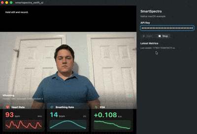
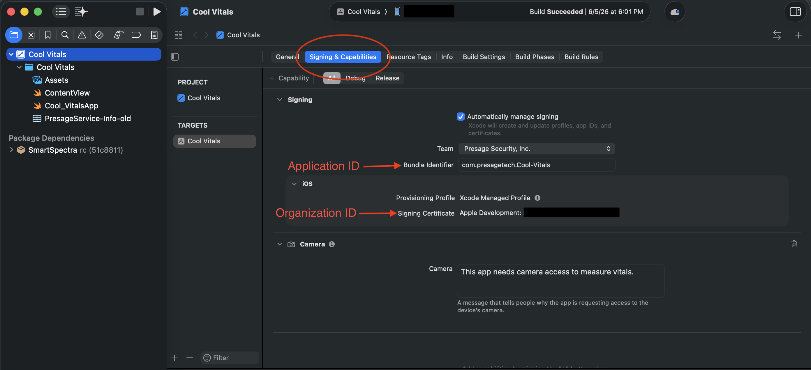

# SmartSpectra C++ Quickstart — macOS

## Supported Platforms

| Platform | Status | Notes |
| -------- | ------ | ----- |
| macOS Apple Silicon (14.0+) | Supported | Homebrew package available |
| macOS Intel | Not supported | — |

For platforms not listed above, contact
[support@presagetech.com](mailto:support@presagetech.com) if you have a
specific need.

## Installation

### Prerequisites

- **Xcode** with Command Line Tools (provides a C++17 toolchain and the Swift compiler)
- **Homebrew**
- **API key** from [physiology.presagetech.com](https://physiology.presagetech.com/auth/login)
- **Apple Development signing identity** — required for SDK startup on macOS

Install Xcode Command Line Tools if you do not have them:

```bash
xcode-select --install
```

### Add the SDK

The Homebrew formula installs the self-contained SmartSpectra SDK and exposes
its CMake package metadata. You do not need to install OpenCV, protobuf, or
other SDK runtime libraries separately — the formula declares them as
dependencies and Homebrew installs them automatically.

```bash
brew tap presage/smartspectra https://github.com/Presage-Security/homebrew-smartspectra
brew install presage/smartspectra/smartspectra
```

For the release-candidate channel, install `smartspectra-rc` instead:

```bash
brew unlink smartspectra
brew install presage/smartspectra/smartspectra-rc
```

### Verify the install

After Homebrew finishes, confirm the SDK is wired up before opening Xcode:

```bash
pkg-config --modversion SmartSpectra
ls /opt/homebrew/lib/cmake/SmartSpectra
```

`pkg-config` should print the installed SDK version. The `ls` should list
the `SmartSpectra` CMake config directory the formula installed (this is
what `find_package(SmartSpectra CONFIG REQUIRED)` in your own CMake project
will pick up — see "Installed Paths" below). If either fails, re-run
`brew install` and check `brew doctor`.

### Permissions

SmartSpectra's default macOS builds require a signed host app with the
keychain entitlements needed for the SDK. This
applies to SDK startup in general, including file-based processing.

The SwiftUI sample below ships with the required entitlements already
configured. For your own integrations, mirror the sample's
`smartspectra_swift_ui.entitlements` file
([stable](https://github.com/Presage-Security/SmartSpectra/blob/main/cpp/samples/macos_swiftui_example/smartspectra_swift_ui.entitlements)
| [rc](https://github.com/Presage-Security/SmartSpectra/blob/rc/cpp/samples/macos_swiftui_example/smartspectra_swift_ui.entitlements)).

## Example

The recommended starting point is the **SmartSpectra SwiftUI macOS sample**,
a native SwiftUI app that opens directly in Xcode and links against the
Homebrew-installed SDK. It demonstrates camera capture, validation status,
breathing/cardio metrics, and trend traces end to end.

Source:

- [Stable sample source](https://github.com/Presage-Security/SmartSpectra/tree/main/cpp/samples/macos_swiftui_example)
- [RC sample source](https://github.com/Presage-Security/SmartSpectra/tree/rc/cpp/samples/macos_swiftui_example)

### Result you should get

At the end, the sample app should show:

- live camera preview
- validation and processing status
- breathing and cardio metric cards
- waveform or trend traces for supported metrics
- a start/stop control for processing



### Clone and verify the environment

Match the branch to the Homebrew formula you installed: `main` for the
stable `smartspectra` formula, `rc` for the `smartspectra-rc` formula.

Stable:

```bash
git clone --branch main https://github.com/Presage-Security/SmartSpectra.git
cd SmartSpectra/cpp/samples/macos_swiftui_example
./scripts/check-requirements.sh
```

Release candidate:

```bash
git clone --branch rc https://github.com/Presage-Security/SmartSpectra.git
cd SmartSpectra/cpp/samples/macos_swiftui_example
./scripts/check-requirements.sh
```

The script checks the Homebrew SDK, required model files, Vulkan/MoltenVK
setup, the SDK graph asset path, and code-signing visibility. To apply safe
runtime fixes (install missing Homebrew packages), run:

```bash
./scripts/check-requirements.sh --fix
```

### Open in Xcode

From `cpp/samples/macos_swiftui_example`, open the Xcode project with:

```bash
open smartspectra_swift_ui.xcodeproj
```

Then select the `smartspectra_swift_ui` scheme and configure signing on the
app target under **Signing & Capabilities**:

```text
Team             = your Apple Development team
Bundle Identifier = a unique identifier for your machine or organization
```

After selecting the app target, this is the Xcode area you should use:



To find your Team ID, open `Xcode > Settings > Accounts`, select your Apple ID
and team, and read the `Team ID` value. From the terminal:

```bash
security find-identity -v -p codesigning
```

The 10-character ID in parentheses at the end of an `Apple Development`
identity is your Team ID.

Press **Run**. Enter your `SMARTSPECTRA_API_KEY` in the app and press **Start**.
On first launch, allow camera access when macOS prompts.

## What success looks like

When your program is running, you should see all of these:

- the sample launches from Xcode without missing SDK or model-file errors
- macOS prompts for camera access on first launch
- the camera preview appears after you allow camera access
- processing starts after you enter a valid API key and press **Start**
- metric cards and traces update while you remain centered and well-lit

## Expected API key check

The first measurement should start after camera permission is granted and the
API key is submitted. If startup fails with an authentication error, verify that
the API key is valid and authorized for this app.

## Common manual mistakes

If the screen does not match the target state, check these first:

- the Homebrew formula channel does not match the sample branch
- `HOMEBREW_PREFIX` or `SMARTSPECTRA_SDK_ROOT` points at the wrong SDK install
- the app target is not signed with an Apple Development identity
- camera permission was denied in macOS System Settings
- the API key was mistyped or copied with extra whitespace
- the app is still running an older build from Xcode

### `brew install presage/smartspectra/smartspectra-rc` fails because `smartspectra` is already linked

If you installed the stable formula first, Homebrew may require the stable
formula to be unlinked before it links the RC formula:

```bash
brew unlink smartspectra
brew install presage/smartspectra/smartspectra-rc
```

### Configuration

If your Homebrew prefix is not `/opt/homebrew`, open the project's Build
Settings and set:

```text
HOMEBREW_PREFIX       = output of `brew --prefix`
SMARTSPECTRA_SDK_ROOT = $(HOMEBREW_PREFIX)
```

The project derives include and library paths from those two variables. The
`Validate Setup` build phase checks the SDK header, library, interface
headers, and OpenCV headers before compilation, so a wrong prefix surfaces
early.

## Additional Details

### Portable `hello_vitals` example

This example also lives in `smartspectra/cpp/samples/hello_vitals/`.

**`hello_vitals.cpp`**:

<!-- BEGIN hello_vitals_cpp -->
```cpp
#include <smartspectra/messages/metrics.h>
#include <smartspectra/smartspectra.h>
#include <smartspectra/smartspectra_config.h>

#include <chrono>
#include <csignal>
#include <cstdlib>
#include <iostream>
#include <string>
#include <thread>

namespace spectra = presage::smartspectra;

namespace {

volatile std::sig_atomic_t g_stop_requested = 0;

void HandleSignal(int) {
    g_stop_requested = 1;
}

std::string ResolveApiKey(int argc, char** argv) {
    if (argc > 1) {
        return argv[1];
    }
    if (const char* key = std::getenv("SMARTSPECTRA_API_KEY")) {
        return key;
    }
    return {};
}

}  // namespace

int main(int argc, char** argv) {
    std::signal(SIGINT, HandleSignal);
    const std::string api_key = ResolveApiKey(argc, argv);
    if (api_key.empty()) {
#if defined(_WIN32)
        std::cerr << "Usage: .\\hello_vitals.exe YOUR_API_KEY\n"
                  << "or set SMARTSPECTRA_API_KEY=YOUR_API_KEY\n";
#else
        std::cerr << "Usage: ./hello_vitals YOUR_API_KEY\n"
                  << "or export SMARTSPECTRA_API_KEY=YOUR_API_KEY\n";
#endif
        return 1;
    }

    spectra::SmartSpectraConfig config;
    config.api_key = api_key;
    config.requested_metrics = spectra::SmartSpectraConfig::BreathingMetrics();
    config.AddMetrics(spectra::SmartSpectraConfig::CardioMetrics());

    spectra::SmartSpectra sdk(config);
    sdk.SetOnMetrics([](const spectra::Metrics& metrics, int64_t) {
        if (metrics.has_cardio()) {
            std::cerr << "Cardio metrics: "
                      << metrics.cardio().ShortDebugString() << "\n";
        }
        if (metrics.has_breathing()) {
            std::cerr << "Breathing metrics: "
                      << metrics.breathing().ShortDebugString() << "\n";
        }
    });
    sdk.SetOnValidationStatusChanged(
        [have_last_status = false,
         last_code = spectra::ValidationCode::kOk,
         last_hint = std::string{}](const spectra::ValidationStatus& status, int64_t) mutable {
            if (have_last_status &&
                status.code == last_code &&
                status.hint == last_hint) {
                return;
            }
            have_last_status = true;
            last_code = status.code;
            last_hint = status.hint;
            std::cerr << "Validation [" << status.code
                      << "]: " << status.hint << "\n";
        });
    sdk.SetOnError([](const spectra::SmartSpectraError& error) {
        std::cerr << "Error [" << static_cast<int>(error.code)
                  << "]: " << error.message << "\n";
    });

    const auto source_error =
        sdk.UseCamera().SetResolution(1280, 720).SetFps(30).Build();
    if (!source_error.ok()) {
        std::cerr << "Failed to create camera source: "
                  << source_error.message << "\n";
        return 1;
    }

    if (const auto err = sdk.Start(); !err.ok()) {
        std::cerr << "Failed to start: " << err.message << "\n";
        return 1;
    }

    std::cout << "Processing... Press Ctrl+C to stop.\n";
    while (!g_stop_requested) {
        std::this_thread::sleep_for(std::chrono::milliseconds(200));
    }
    if (const auto err = sdk.Stop(); !err.ok()) {
        std::cerr << "Stop failed: " << err.message << "\n";
    }
    return 0;
}
```
<!-- END hello_vitals_cpp -->

The accompanying standalone project files are in that folder. To run the binary
end to end on macOS, wrap and sign it using the app-style flow in
`smartspectra/cpp/samples/README.md#macos-signing`, or use the SwiftUI sample
above.

### Installed Paths

On Apple Silicon Homebrew installs, the default paths are:

- **Headers**: `/opt/homebrew/include/smartspectra/`
- **Libraries**: `/opt/homebrew/lib/`
- **CMake config**: `/opt/homebrew/lib/cmake/SmartSpectra/`
- **pkg-config**: `/opt/homebrew/lib/pkgconfig/SmartSpectra.pc`

Consumer code includes SmartSpectra headers as:

```cpp
#include <smartspectra/smartspectra.h>
#include <smartspectra/smartspectra_config.h>
#include <smartspectra/messages/metrics.h>
```

When linking from your own CMake project:

```cmake
find_package(SmartSpectra CONFIG REQUIRED)
target_link_libraries(my_app PRIVATE SmartSpectra::SDK)
```

### Release-Candidate Builds

Release-candidate builds are published as a separate Homebrew formula,
`smartspectra-rc`, served by the same tap as the stable formula. Stable users
see no change; RC opt-in is additive.

```bash
brew install presage/smartspectra/smartspectra-rc
```

Release candidates do not automatically migrate to the stable formula. After a
stable release ships, uninstall `smartspectra-rc` and install `smartspectra`
to return to the stable channel:

```bash
brew uninstall presage/smartspectra/smartspectra-rc
brew install presage/smartspectra/smartspectra
```

## Distributing an app that embeds the SDK (signing & notarization)

If you ship a macOS app that bundles `libsmartspectra.dylib` to other Macs,
[Apple notarization](https://developer.apple.com/documentation/security/notarizing-macos-software-before-distribution)
will reject the submission unless every embedded Mach-O is signed with **your**
Developer ID, has the
[**hardened runtime**](https://developer.apple.com/documentation/security/hardened-runtime)
enabled, and carries a **secure timestamp**.

The Homebrew-installed SDK does **not** satisfy this on its own. The formula
ships `libsmartspectra.dylib` **ad-hoc signed** (no Developer ID, no team
identifier, no secure timestamp), because Homebrew rewrites the library's
install names on install and re-signs it ad-hoc. So you must (re-)sign the
copy you embed in your app bundle — you cannot rely on the signature it has
when Homebrew installs it.

### Re-sign the embedded library with your own identity

The embedded copy must be signed with the **same** identity as your app, for
two reasons: notarization requires a Developer ID signature with a secure
timestamp, and macOS **library validation** (in force once the hardened
runtime is enabled) refuses to load a dylib whose Team ID differs from the
host app's. Re-signing the copy you bundle satisfies both. (If you must keep a
differently-signed copy instead, the host app needs the
[Disable Library Validation entitlement](https://developer.apple.com/documentation/BundleResources/Entitlements/com.apple.security.cs.disable-library-validation),
which weakens its security posture and is not recommended.)

**Xcode (recommended).** Add `libsmartspectra.dylib` to your target under
**Frameworks, Libraries, and Embedded Content** and set it to **Embed & Sign**
(not "Embed Without Signing"). Xcode then re-signs the embedded copy with your
team's identity, hardened runtime, and a secure timestamp on each build.

**Command-line / non-Xcode builds.** Re-sign the bundled copy yourself, as the
last step before signing the app (any `install_name_tool` edit invalidates a
signature, so sign last):

```bash
codesign --force --options runtime --timestamp \
  --sign "Developer ID Application: <Your Org> (<TEAMID>)" \
  "<YourApp>.app/Contents/Frameworks/libsmartspectra.dylib"
```

Then sign the app itself with the same identity and `--options runtime`, submit
with `xcrun notarytool submit --wait`, and `xcrun stapler staple` the result.
See Apple's
[Customizing the notarization workflow](https://developer.apple.com/documentation/security/customizing-the-notarization-workflow)
for the full `notarytool`/`stapler` flow.

### Make the bundle self-contained first

The Homebrew library records **absolute** load paths
(`/opt/homebrew/opt/smartspectra/lib/...`) and links its OpenCV, Vulkan loader,
and MoltenVK dependencies by absolute `/opt/homebrew/opt/...` paths — those
won't exist on a customer's Mac. Before signing, copy `libsmartspectra.dylib`
**and its Homebrew dependency tree** into `Contents/Frameworks`, rewrite the
install names to `@rpath`, and add an `@executable_path/../Frameworks` rpath to
your executable. A tool such as
[`dylibbundler`](https://github.com/auriamg/macdylibbundler) automates the copy
and relocation; re-sign every relocated Mach-O afterward as shown above.

> Note: the brew-installed library is not subject to Gatekeeper itself —
> Homebrew downloads are not quarantined, so `brew install` users need no
> signing action. The requirements above apply only when you redistribute the
> library inside your own app bundle.

Apple references:

- [Notarizing macOS software before distribution](https://developer.apple.com/documentation/security/notarizing-macos-software-before-distribution)
- [Customizing the notarization workflow](https://developer.apple.com/documentation/security/customizing-the-notarization-workflow) (`notarytool` / `stapler`)
- [Hardened Runtime](https://developer.apple.com/documentation/security/hardened-runtime)
- [Disable Library Validation Entitlement](https://developer.apple.com/documentation/BundleResources/Entitlements/com.apple.security.cs.disable-library-validation)

## Next Steps

- [Configure which metrics to compute](metrics.md)
- [Run headless without video output](headless-mode.md)
- [Migration Guide](migration-guide.md) for upgrading from older SDK versions

## Documentation

API reference available at [C++ API Reference](api-reference.md).

## Troubleshooting

### Runtime libraries or model files missing

If you see errors about a missing Vulkan loader, MoltenVK driver, or
`.tflite` model files, run the sample's diagnostic script:

```bash
./scripts/check-requirements.sh --fix
```

It verifies the Homebrew SDK install, repairs the graph asset path, and
reinstalls any missing runtime packages.

### Metrics do not appear immediately

Keep the subject still and centered in the camera preview until validation
reports that recording is OK.

For support: contact [support@presagetech.com](mailto:support@presagetech.com)
or [submit a GitHub issue](https://github.com/Presage-Security/SmartSpectra/issues).
