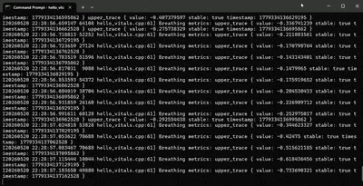

# SmartSpectra C++ Quickstart — Windows

> **Warning — Experimental platform:** Windows support for the SmartSpectra
> C++ SDK is experimental. If you have any issues running SmartSpectra,
> [contact Presage support](mailto:support@presagetech.com) for assistance.

## Supported Platforms

| Platform | Status | Notes |
| -------- | ------ | ----- |
| Windows 10 / 11 (x64) | Experimental | ZIP distribution available |

For platforms not listed above, contact
[support@presagetech.com](mailto:support@presagetech.com) if you have a
specific need.

## Installation

### Prerequisites

Install [Visual Studio Build Tools 2022](https://visualstudio.microsoft.com/visual-cpp-build-tools/)
or later — or a full Visual Studio 2022 or newer install (Community edition works) — with the
**Desktop development with C++** workload.

During installation, select the **Desktop development with C++** workload and
make sure **C++ CMake tools for Windows** is selected. The workload installs
the MSVC compiler, Windows SDK, CMake, and the developer command prompt needed
for the quickstart below.

You also need an **API key** from [physiology.presagetech.com](https://physiology.presagetech.com/auth/login).

### Add the SDK

Download `smartspectra-sdk-<version>-windows-x64.zip` from
[GitHub Releases](https://github.com/Presage-Security/SmartSpectra/releases)
and extract it to a permanent location, for example `C:\SmartSpectra`.

Keep the extracted layout intact — CMake config files, runtime DLLs, and
bundled resources must stay in the locations expected by the package.

### Permissions

No SDK-specific OS permission setup is required on Windows.

## Example: CMake Project

This walkthrough sets up a minimal CMake project that reads from a camera and
prints vitals to the console.

### Result you should get

At the end, the app should show console output with:

- a successful CMake configure and build
- `Processing... Press Ctrl+C to stop.`
- `Cardio metrics:` log lines when cardio metrics are available
- `Breathing metrics:` log lines when breathing metrics are available
- a clean exit after you stop the sample



### 1. Open the developer command prompt

Open the Windows **Start** menu and search for `x64 Developer Command Prompt` (a full Visual
Studio install names it `x64 Native Tools Command Prompt for VS <year>`).
Choose the x64 developer command prompt installed by Visual Studio (Build Tools or a full install).

For a default Build Tools installation, that shortcut launches:

```bat
C:\Windows\System32\cmd.exe /k ""C:\Program Files (x86)\Microsoft Visual Studio\2022\BuildTools\Common7\Tools\VsDevCmd.bat" -arch=x64 -host_arch=x64"
```

If you installed Build Tools somewhere else — or use a full Visual Studio install — update the
`VsDevCmd.bat` path to match. For example, Visual Studio 2026 Community installs it at
`C:\Program Files\Microsoft Visual Studio\18\Community\Common7\Tools\VsDevCmd.bat`.

### 2. Create the project files

Create a folder, for example `C:\Projects\HelloVitals`, and add these two
files inside it.

**`CMakeLists.txt`**:

```cmake
cmake_minimum_required(VERSION 3.22.1)
project(HelloVitals CXX)
set(CMAKE_CXX_STANDARD 20)
set(CMAKE_CXX_STANDARD_REQUIRED ON)

set(SMARTSPECTRA_SDK_DIR "$ENV{SMARTSPECTRA_SDK_PATH}")
if (SMARTSPECTRA_SDK_DIR STREQUAL "")
    message(FATAL_ERROR "SMARTSPECTRA_SDK_PATH is not set.")
endif ()

list(APPEND CMAKE_PREFIX_PATH "${SMARTSPECTRA_SDK_DIR}")
find_package(SmartSpectra CONFIG REQUIRED)

add_executable(hello_vitals hello_vitals.cpp)
target_link_libraries(hello_vitals SmartSpectra::SDK)
```

**`hello_vitals.cpp`**:

This example also lives in `smartspectra/cpp/samples/hello_vitals/`.

<!-- BEGIN hello_vitals_cpp -->
```cpp
#include <smartspectra/messages/metrics.h>
#include <smartspectra/smartspectra.h>
#include <smartspectra/smartspectra_config.h>

#include <chrono>
#include <csignal>
#include <cstdlib>
#include <iostream>
#include <string>
#include <thread>

namespace spectra = presage::smartspectra;

namespace {

volatile std::sig_atomic_t g_stop_requested = 0;

void HandleSignal(int) {
    g_stop_requested = 1;
}

std::string ResolveApiKey(int argc, char** argv) {
    if (argc > 1) {
        return argv[1];
    }
    if (const char* key = std::getenv("SMARTSPECTRA_API_KEY")) {
        return key;
    }
    return {};
}

}  // namespace

int main(int argc, char** argv) {
    std::signal(SIGINT, HandleSignal);
    const std::string api_key = ResolveApiKey(argc, argv);
    if (api_key.empty()) {
#if defined(_WIN32)
        std::cerr << "Usage: .\\hello_vitals.exe YOUR_API_KEY\n"
                  << "or set SMARTSPECTRA_API_KEY=YOUR_API_KEY\n";
#else
        std::cerr << "Usage: ./hello_vitals YOUR_API_KEY\n"
                  << "or export SMARTSPECTRA_API_KEY=YOUR_API_KEY\n";
#endif
        return 1;
    }

    spectra::SmartSpectraConfig config;
    config.api_key = api_key;
    config.requested_metrics = spectra::SmartSpectraConfig::BreathingMetrics();
    config.AddMetrics(spectra::SmartSpectraConfig::CardioMetrics());

    spectra::SmartSpectra sdk(config);
    sdk.SetOnMetrics([](const spectra::Metrics& metrics, int64_t) {
        if (metrics.has_cardio()) {
            std::cerr << "Cardio metrics: "
                      << metrics.cardio().ShortDebugString() << "\n";
        }
        if (metrics.has_breathing()) {
            std::cerr << "Breathing metrics: "
                      << metrics.breathing().ShortDebugString() << "\n";
        }
    });
    sdk.SetOnValidationStatusChanged(
        [have_last_status = false,
         last_code = spectra::ValidationCode::kOk,
         last_hint = std::string{}](const spectra::ValidationStatus& status, int64_t) mutable {
            if (have_last_status &&
                status.code == last_code &&
                status.hint == last_hint) {
                return;
            }
            have_last_status = true;
            last_code = status.code;
            last_hint = status.hint;
            std::cerr << "Validation [" << status.code
                      << "]: " << status.hint << "\n";
        });
    sdk.SetOnError([](const spectra::SmartSpectraError& error) {
        std::cerr << "Error [" << static_cast<int>(error.code)
                  << "]: " << error.message << "\n";
    });

    const auto source_error =
        sdk.UseCamera().SetResolution(1280, 720).SetFps(30).Build();
    if (!source_error.ok()) {
        std::cerr << "Failed to create camera source: "
                  << source_error.message << "\n";
        return 1;
    }

    if (const auto err = sdk.Start(); !err.ok()) {
        std::cerr << "Failed to start: " << err.message << "\n";
        return 1;
    }

    std::cout << "Processing... Press Ctrl+C to stop.\n";
    while (!g_stop_requested) {
        std::this_thread::sleep_for(std::chrono::milliseconds(200));
    }
    if (const auto err = sdk.Stop(); !err.ok()) {
        std::cerr << "Stop failed: " << err.message << "\n";
    }
    return 0;
}
```
<!-- END hello_vitals_cpp -->

### 3. Build

Navigate to your project folder with the two files, for example:

```bat
cd /d C:\Projects\HelloVitals
```

Configure and build with CMake. Update `C:\SmartSpectra` if you extracted the
SDK somewhere else.

```bat
set "SMARTSPECTRA_SDK_PATH=C:\SmartSpectra" && cmake -S . -B build -G "NMake Makefiles" -DCMAKE_BUILD_TYPE=Release && cmake --build build
```

### 4. Run

The executable needs the SDK runtime DLLs (`smartspectra.dll`, `opencv_world*.dll`,
`vulkan-1.dll`, …) on its load path. The simplest way is to put the SmartSpectra SDK `bin/`
directory on `PATH` for the session — Windows then loads the DLLs from there, and
the SDK finds its bundled resources relative to `smartspectra.dll`. No copying and
no resource configuration are required:

```bat
set "PATH=%SMARTSPECTRA_SDK_PATH%\bin;%PATH%"
.\build\hello_vitals.exe YOUR_API_KEY
```

Or set the key once in the shell as well:

```bat
set "SMARTSPECTRA_API_KEY=YOUR_API_KEY" && .\build\hello_vitals.exe
```

You should see breathing and cardio metrics printed to the console within a few
seconds of the camera starting. Press `Ctrl+C` to stop the sample.

## What success looks like

When your program is running, you should see all of these:

- `Processing... Press Ctrl+C to stop.` prints after launch
- the camera starts without a source creation error
- `Cardio metrics:` or `Breathing metrics:` logs print while you sit centered and well-lit
- the process exits after `Ctrl+C` without a `Stop failed` message

## Expected API key check

The first measurement should start after the executable launches with a valid
API key argument or `SMARTSPECTRA_API_KEY` environment variable. If startup
fails with an authentication error, verify that the key is authorized for this
app and that the shell value did not include extra quotes or whitespace.

## Common manual mistakes

If the console output does not match the target state, check these first:

- the ZIP was extracted into a different folder than `SMARTSPECTRA_SDK_PATH`
- the project was built outside the x64 developer command prompt
- the API key argument or `SMARTSPECTRA_API_KEY` environment variable is missing
- the SDK `bin/` directory is not on `PATH`, so the runtime DLLs can't be found
- the runtime DLLs were copied away from the SDK `bin/`, separating them from the
  sibling `share/smartspectra/` resource tree
- another app is already using the camera
- the executable is an older build from before the latest source change

## Additional Details

### Metric selection

Adjust the metric bundles in `hello_vitals.cpp` before building:

```cpp
config.requested_metrics = spectra::SmartSpectraConfig::BreathingMetrics();
config.AddMetrics(spectra::SmartSpectraConfig::CardioMetrics());
```

Available bundles: `BreathingMetrics()`, `CardioMetrics()`, `FaceMetrics()`.

### ZIP layout reference

```text
include/
  smartspectra/                    # C++ SDK headers and protobuf metric headers
  smartspectra/interface/          # Bundled third-party headers
  smartspectra_capi.h              # C ABI shim for FFI consumers
lib/
  smartspectra.lib                             # C++ SDK import library (MSVC)
  smartspectra_capi.lib                        # C ABI shim import library
  SmartSpectra_MessageProtos_*.lib             # Message proto static libs
  cmake/SmartSpectra/SmartSpectraConfig.cmake  # CMake package
bin/
  smartspectra.dll            # C++ SDK runtime DLL — must ship with your app
  smartspectra_capi.dll       # C ABI shim runtime DLL — required for FFI consumers
  vulkan-1.dll                # Vulkan loader used by the default inference backend
  smartspectra_manifest.json  # lets smartspectra.dll locate ../share/smartspectra
  opencv_world*.dll           # OpenCV runtime dependency — must ship with your app
  opencv_videoio_ffmpeg*.dll  # OpenCV FFmpeg video-I/O backend (needed for video-file input)
share/smartspectra/           # Bundled graph and model resources
```

When you ship your app to other machines, keep the `bin/` and `share/` directories
together as a unit — the SDK locates its resources at `bin/../share/smartspectra`
relative to `smartspectra.dll`, so the relationship between the two must be
preserved. The recommended layout is to place your executable in `bin/` (or copy
the whole `bin/ + share/` tree into your install directory); the DLLs then load
without any `PATH` setup and resources resolve automatically. Do **not** copy the
DLLs out on their own — separating `smartspectra.dll` from its sibling `share/`
tree is what breaks resource resolution.

## Next Steps

- [Configure which metrics to compute](../metrics.md)
- [Run headless without video output](../headless-mode.md)
- [Migration Guide](../migration-guide.md) for upgrading from older SDK versions

## Troubleshooting

If the app starts but can't find DLLs, verify that the SDK `bin/` directory is on
`PATH` (or that your executable sits in `bin/` alongside `smartspectra.dll`,
`opencv_world*.dll`, and the other SDK DLLs).

If the app loads but fails to find its models/graph resources, the runtime DLLs
were likely separated from the SDK's `share/smartspectra/` tree. Keep `bin/` and
`share/` together — the SDK resolves resources at `bin/../share/smartspectra`
relative to `smartspectra.dll`.

If you are upgrading an older C++ integration, see the [C++ Migration Guide](../migration-guide.md).

For support: contact [support@presagetech.com](mailto:support@presagetech.com) or [submit a GitHub issue](https://github.com/Presage-Security/SmartSpectra/issues).
