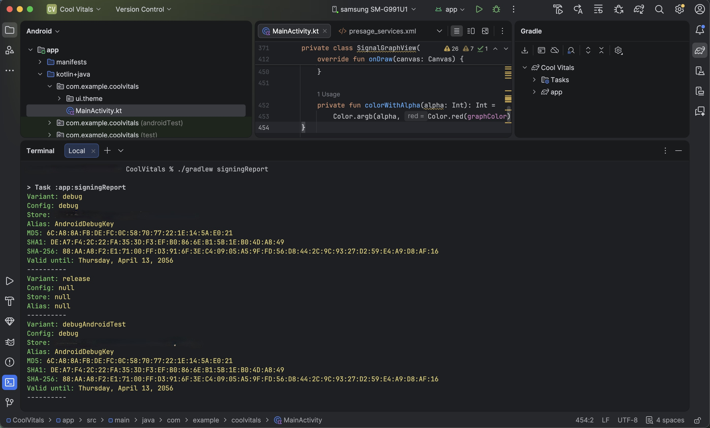

# QuickStart - OAuth

Use this if you want to use SmartSpectra OAuth instead of an API key.

Android OAuth is currently documented for Play Store releases. For local development, internal QA, or sideloaded debug builds, use [Option 1: API Key](OPTION_1_API_KEY.md) instead.

## What you will change manually

You will touch exactly these things:

1. The app Gradle repositories and dependencies
2. The OAuth app registration in the Presage developer portal
3. The OAuth XML file at `app/src/main/res/xml/presage_services.xml`
4. `app/src/main/java/com/example/coolvitals/MainActivity.kt`

You do not need to create XML layouts or additional Kotlin files.

## Result you should get

At the end, the app should show:

- live camera preview
- heart rate and expression cards
- breathing rate and breathing waveform
- arterial pressure waveform
- status text and a start/stop button
- one portrait screen with no scrolling

## Step 1 — Create the project

In Android Studio, create a new Android app project:

1. Select `File` → `New` → `New Project...`
2. Choose `Empty Activity`
3. Set `Name` to `Cool Vitals`
4. Set `Package name` to `com.example.coolvitals`
5. Set `Language` to `Kotlin`
6. Set `Minimum SDK` to `API 28` or newer
7. Finish creating the project

If you already created the project, open it instead.

Open your Android app project in Android Studio.

## Step 2 — Add repositories

In your project-level `settings.gradle.kts`, make sure the app can resolve AndroidX and SmartSpectra artifacts:

```kotlin
dependencyResolutionManagement {
    repositoriesMode.set(RepositoriesMode.FAIL_ON_PROJECT_REPOS)
    repositories {
        google()
        mavenCentral()
        // Required only for versions ending in -SNAPSHOT.
        maven {
            url = uri("https://central.sonatype.com/repository/maven-snapshots/")
            mavenContent {
                snapshotsOnly()
            }
        }
    }
}
```

## Step 3 — Add app dependencies

In `app/build.gradle.kts`, keep the dependencies generated by the `Empty Activity` template and add only these lines to the existing `dependencies` block:

```kotlin
dependencies {
    implementation("androidx.camera:camera-view:1.6.0")

    // Replace <stableSdkVersion> with the value from android/samples/version.properties.
    implementation("com.presagetech:smartspectra:<stableSdkVersion>")

    // For release-candidate snapshots, use this instead:
    // implementation("com.presagetech:smartspectra:<rcSdkVersion>-SNAPSHOT")
}
```

Version values:

- For stable releases, replace `<stableSdkVersion>` with the value from [`android/samples/version.properties`](https://github.com/Presage-Security/SmartSpectra/blob/main/android/samples/version.properties).
- For release-candidate snapshots, replace `<rcSdkVersion>` with the value from [`android/samples/version.properties`](https://github.com/Presage-Security/SmartSpectra/blob/rc/android/samples/version.properties) and keep the `-SNAPSHOT` suffix.
- You can also browse stable releases on [Maven Central](https://central.sonatype.com/artifact/com.presagetech/smartspectra/versions).

Manual check:

- Gradle sync succeeds
- `PreviewView`, `SmartSpectraSdk`, and `MetricType` imports resolve

## Step 4 — Get `presage_services.xml`

This file is not created by Android Studio and is not included automatically when you add the SmartSpectra dependency.

You need to get it from Presage first:

1. Sign in to the Presage developer portal: `https://physiology.presagetech.com/`
2. Open **Account** → **Registered App for OAuth**
3. Select `Android`
4. Enter your Android App ID. For this quickstart, use `com.example.coolvitals`.
5. Enter the SHA-256 fingerprint for the signing certificate used by the app you will release.
6. Click **Register App ID**
7. Download the Android OAuth config file named `presage_services.xml`

If you are testing a sandbox-enabled app registration, make sure the app row shows **Sandbox Status: Enabled**. Click **Enable** if sandbox is not already enabled.

See Google's [Authenticating Your Client](https://developers.google.com/android/guides/client-auth) guide for Android signing certificate fingerprints.

To get the SHA-256 fingerprint from Gradle, run:

```bash
./gradlew signingReport
```



If you cannot find a download for `presage_services.xml`, stop here. Ask [Presage support](mailto:support@presagetech.com) or your Presage contact for the Android OAuth XML for this app.

## Step 5 — Add `presage_services.xml` to the app

In Android Studio:

1. Create `app/src/main/res/xml/` if it does not already exist
2. Put `presage_services.xml` in that directory
3. Confirm the file is packaged with the app target

The file should contain the OAuth fields provided by Presage, for example:

```xml
<?xml version="1.0" encoding="utf-8"?>
<resources xmlns:android="http://schemas.android.com/apk/res/android">
    <string name="oauth_enabled">true</string>
    <string name="client_id">your_client_id</string>
    <string name="sub">your_sub</string>
    <string name="config_version">1.0</string>
</resources>
```

## Step 6 — Replace `MainActivity.kt`

In Android Studio:

1. Open `app/src/main/java/com/example/coolvitals/MainActivity.kt`
2. Delete everything in the file
3. Paste the full file below

Paste this entire file:

```kotlin
package com.example.coolvitals

import android.Manifest
import android.content.Context
import android.content.pm.PackageManager
import android.content.res.ColorStateList
import android.graphics.Canvas
import android.graphics.Color
import android.graphics.Paint
import android.graphics.Path
import android.graphics.drawable.GradientDrawable
import android.os.Bundle
import android.view.Gravity
import android.view.View
import android.view.ViewGroup
import android.widget.Button
import android.widget.FrameLayout
import android.widget.LinearLayout
import android.widget.TextView
import androidx.activity.ComponentActivity
import androidx.activity.result.contract.ActivityResultContracts
import androidx.camera.view.PreviewView
import androidx.core.content.ContextCompat
import androidx.lifecycle.lifecycleScope
import com.presagetech.smartspectra.CameraPosition
import com.presagetech.smartspectra.ProcessingStatus
import com.presagetech.smartspectra.SmartSpectraConfig
import com.presagetech.smartspectra.SmartSpectraSdk
import com.presagetech.smartspectra.proto.MetricTypesProto.MetricType
import com.presagetech.smartspectra.proto.MetricsProto.ExpressionType
import kotlin.math.max
import kotlin.math.min
import kotlin.math.roundToInt
import kotlinx.coroutines.launch

class MainActivity : ComponentActivity() {
    private companion object {
        val TEXT_PRIMARY = Color.WHITE
        val TEXT_MUTED = 0x80FFFFFF.toInt()
        val CARD_OVERLAY = 0x2E000000
        val CORAL = 0xFFFF6B6B.toInt()
        val TEAL = 0xFF4FCCC4.toInt()
        val VIOLET = 0xFFA58CF9.toInt()
    }

    private val sdk by lazy { SmartSpectraSdk.shared }

    private lateinit var heartRateLabel: TextView
    private lateinit var expressionLabel: TextView
    private lateinit var breathingRateLabel: TextView
    private lateinit var breathingGraphView: SignalGraphView
    private lateinit var bloodPressureGraphView: SignalGraphView
    private lateinit var statusLabel: TextView
    private lateinit var toggleButton: Button

    private var latestBreathingTimestamp: Long = Long.MIN_VALUE
    private var latestPressureTimestamp: Long = Long.MIN_VALUE

    private val cameraPermissionLauncher = registerForActivityResult(
        ActivityResultContracts.RequestPermission(),
    ) { granted ->
        if (granted) {
            startProcessing()
        } else {
            statusLabel.text = "Camera permission is required to start."
        }
    }

    override fun onCreate(savedInstanceState: Bundle?) {
        super.onCreate(savedInstanceState)

        sdk.config.imageOutputEnabled = false
        sdk.config.cameraPosition = CameraPosition.FRONT
        sdk.config.requestedMetrics =
            SmartSpectraConfig.breathingMetrics +
                    SmartSpectraConfig.cardioMetrics +
                    listOf(MetricType.EXPRESSIONS)

        buildUi()
        bindSdk()
        resetMeasurementUi()
        statusLabel.text = "Idle"
    }

    override fun onPause() {
        super.onPause()
        lifecycleScope.launch {
            when (sdk.processingStatus.value) {
                ProcessingStatus.RUNNING,
                ProcessingStatus.STARTING,
                ProcessingStatus.STOPPING,
                    -> runCatching { sdk.stop() }
                else -> Unit
            }
        }
    }

    private fun bindSdk() {
        sdk.processingStatus.observe(this) { updateProcessingStatus(it) }
        sdk.error.observe(this) { error ->
            if (error != null) {
                statusLabel.text = "Error: ${error.message}"
            }
        }
        sdk.metrics.observe(this) { metrics ->
            if (metrics == null) return@observe

            if (metrics.hasCardio()) {
                val pulse = metrics.cardio.pulseRateList
                    .lastOrNull { it.timestamp > 0 }
                    ?.value
                    ?.roundToInt()
                if (pulse != null) {
                    heartRateLabel.text = "$pulse bpm"
                }

                metrics.cardio.arterialPressureTraceList.forEach { sample ->
                    if (sample.timestamp > latestPressureTimestamp) {
                        latestPressureTimestamp = sample.timestamp
                        bloodPressureGraphView.appendValue(sample.value)
                    }
                }
            }

            if (metrics.hasBreathing()) {
                if (metrics.breathing.rateCount > 0) {
                    val breathingRate = metrics.breathing.rateList.last().value.roundToInt()
                    breathingRateLabel.text = "Breathing Rate  $breathingRate brpm"
                }

                metrics.breathing.upperTraceList.forEach { sample ->
                    if (sample.timestamp > latestBreathingTimestamp) {
                        latestBreathingTimestamp = sample.timestamp
                        breathingGraphView.appendValue(sample.value)
                    }
                }
            }

            if (metrics.hasFace()) {
                val expression = metrics.face.expressionList.lastOrNull() ?: return@observe
                val topScore = expression.scoresList
                    .filter { it.confidence > 0f }
                    .maxByOrNull { it.confidence } ?: return@observe
                val expressionName = topScore.type.expressionName() ?: return@observe
                expressionLabel.text = "$expressionName  ${(topScore.confidence * 100).roundToInt()}%"
            }
        }

    }

    private fun buildUi() {
        val root = FrameLayout(this).apply {
            setBackgroundColor(Color.BLACK)
        }

        val previewView = PreviewView(this).apply {
            contentDescription = "SmartSpectra preview output"
            setBackgroundColor(Color.BLACK)
            scaleType = PreviewView.ScaleType.FILL_CENTER
            implementationMode = PreviewView.ImplementationMode.PERFORMANCE
        }
        sdk.config.previewSurfaceProvider = previewView.surfaceProvider
        root.addView(
            previewView,
            FrameLayout.LayoutParams(
                ViewGroup.LayoutParams.MATCH_PARENT,
                ViewGroup.LayoutParams.MATCH_PARENT,
            ),
        )

        val panel = LinearLayout(this).apply {
            orientation = LinearLayout.VERTICAL
            setPadding(dp(16), dp(12), dp(16), dp(18))
        }
        root.addView(
            panel,
            FrameLayout.LayoutParams(
                ViewGroup.LayoutParams.MATCH_PARENT,
                ViewGroup.LayoutParams.WRAP_CONTENT,
                Gravity.BOTTOM,
            ),
        )

        heartRateLabel = textView(sizeSp = 28f, color = CORAL, bold = true)
        panel.addView(
            card {
                addView(textView("Heart Rate", sizeSp = 12f, color = TEXT_MUTED))
                addView(heartRateLabel, matchWrapTopMargin(dp(2)))
            },
            matchWrapBottomMargin(dp(8)),
        )

        expressionLabel = textView(sizeSp = 18f, color = TEXT_PRIMARY, bold = true)
        panel.addView(
            card {
                addView(textView("Expression", sizeSp = 12f, color = TEXT_MUTED))
                addView(expressionLabel, matchWrapTopMargin(dp(2)))
            },
            matchWrapBottomMargin(dp(8)),
        )

        breathingRateLabel = textView(sizeSp = 12f, color = TEXT_MUTED)
        breathingGraphView = SignalGraphView(this, TEAL)
        panel.addView(
            card {
                addView(breathingRateLabel)
                addView(
                    breathingGraphView,
                    LinearLayout.LayoutParams(
                        ViewGroup.LayoutParams.MATCH_PARENT,
                        dp(72),
                    ).apply { topMargin = dp(4) },
                )
            },
            matchWrapBottomMargin(dp(8)),
        )

        bloodPressureGraphView = SignalGraphView(this, VIOLET)
        panel.addView(
            card {
                addView(textView("Blood Pressure Trace", sizeSp = 12f, color = TEXT_MUTED))
                addView(
                    bloodPressureGraphView,
                    LinearLayout.LayoutParams(
                        ViewGroup.LayoutParams.MATCH_PARENT,
                        dp(72),
                    ).apply { topMargin = dp(4) },
                )
            },
            matchWrapBottomMargin(dp(8)),
        )

        statusLabel = textView(sizeSp = 12f, color = TEXT_MUTED).apply {
            gravity = Gravity.CENTER
        }
        panel.addView(statusLabel)

        toggleButton = Button(this).apply {
            text = "Start"
            setAllCaps(false)
            setTextColor(TEXT_PRIMARY)
            backgroundTintList = ColorStateList.valueOf(CORAL)
            setOnClickListener { toggleProcessing() }
        }
        panel.addView(
            toggleButton,
            LinearLayout.LayoutParams(
                ViewGroup.LayoutParams.MATCH_PARENT,
                dp(48),
            ).apply { topMargin = dp(10) },
        )

        setContentView(root)
    }

    private fun toggleProcessing() {
        when (sdk.processingStatus.value) {
            ProcessingStatus.RUNNING -> lifecycleScope.launch { runCatching { sdk.stop() } }
            ProcessingStatus.STARTING, ProcessingStatus.STOPPING -> Unit
            else -> startProcessing()
        }
    }

    private fun startProcessing() {
        if (ContextCompat.checkSelfPermission(this, Manifest.permission.CAMERA)
            != PackageManager.PERMISSION_GRANTED
        ) {
            cameraPermissionLauncher.launch(Manifest.permission.CAMERA)
            return
        }
        lifecycleScope.launch {
            resetMeasurementUi()
            runCatching { sdk.start() }
                .onFailure {
                    statusLabel.text = "Error: ${it.message ?: "Unknown error"}"
                }
        }
    }

    private fun updateProcessingStatus(status: ProcessingStatus?) {
        when (status) {
            ProcessingStatus.IDLE -> {
                statusLabel.text = "Idle"
                toggleButton.text = "Start"
                toggleButton.isEnabled = true
            }
            ProcessingStatus.STARTING -> {
                statusLabel.text = "Starting"
                toggleButton.text = "Starting..."
                toggleButton.isEnabled = false
            }
            ProcessingStatus.RUNNING -> {
                statusLabel.text = "Running"
                toggleButton.text = "Stop"
                toggleButton.isEnabled = true
            }
            ProcessingStatus.STOPPING -> {
                statusLabel.text = "Stopping"
                toggleButton.text = "Stopping..."
                toggleButton.isEnabled = false
            }
            ProcessingStatus.ERROR -> {
                toggleButton.text = "Start"
                toggleButton.isEnabled = true
            }
            null -> Unit
        }
    }

    private fun resetMeasurementUi() {
        latestBreathingTimestamp = Long.MIN_VALUE
        latestPressureTimestamp = Long.MIN_VALUE
        breathingGraphView.reset()
        bloodPressureGraphView.reset()
        heartRateLabel.text = "-- bpm"
        expressionLabel.text = "--"
        breathingRateLabel.text = "Breathing Rate"
    }

    private fun card(buildChildren: LinearLayout.() -> Unit): LinearLayout =
        LinearLayout(this).apply {
            orientation = LinearLayout.VERTICAL
            background = GradientDrawable().apply {
                setColor(CARD_OVERLAY)
                cornerRadius = dp(20).toFloat()
            }
            setPadding(dp(12), dp(8), dp(12), dp(8))
            buildChildren()
        }

    private fun textView(
        text: String = "",
        sizeSp: Float,
        color: Int,
        bold: Boolean = false,
    ): TextView = TextView(this).apply {
        this.text = text
        textSize = sizeSp
        setTextColor(color)
        if (bold) typeface = android.graphics.Typeface.DEFAULT_BOLD
    }

    private fun matchWrapBottomMargin(bottomMargin: Int): LinearLayout.LayoutParams =
        LinearLayout.LayoutParams(
            ViewGroup.LayoutParams.MATCH_PARENT,
            ViewGroup.LayoutParams.WRAP_CONTENT,
        ).apply { this.bottomMargin = bottomMargin }

    private fun matchWrapTopMargin(topMargin: Int): LinearLayout.LayoutParams =
        LinearLayout.LayoutParams(
            ViewGroup.LayoutParams.MATCH_PARENT,
            ViewGroup.LayoutParams.WRAP_CONTENT,
        ).apply { this.topMargin = topMargin }

    private fun dp(value: Int): Int = (value * resources.displayMetrics.density).roundToInt()

    private fun ExpressionType.expressionName(): String? =
        when (this) {
            ExpressionType.ANGRY -> "Angry"
            ExpressionType.CONTEMPT -> "Contempt"
            ExpressionType.DISGUST -> "Disgust"
            ExpressionType.FEAR -> "Fear"
            ExpressionType.HAPPY -> "Happy"
            ExpressionType.NEUTRAL -> "Neutral"
            ExpressionType.SAD -> "Sad"
            ExpressionType.SURPRISE -> "Surprise"
            else -> null
        }
}

private class SignalGraphView(
    context: Context,
    private val graphColor: Int,
) : View(context) {
    private companion object {
        const val GRID_ALPHA = 12
        const val LINE_ALPHA = 170
    }

    private val samples = ArrayDeque<Float>()
    private val maxPoints = 200
    private val inset = 10f
    private val linePath = Path()

    private val gridPaint = Paint(Paint.ANTI_ALIAS_FLAG).apply {
        color = Color.argb(GRID_ALPHA, 255, 255, 255)
        strokeWidth = 1f
        style = Paint.Style.STROKE
    }

    private val linePaint = Paint(Paint.ANTI_ALIAS_FLAG).apply {
        color = colorWithAlpha(LINE_ALPHA)
        strokeWidth = 3.5f
        style = Paint.Style.STROKE
        strokeCap = Paint.Cap.ROUND
        strokeJoin = Paint.Join.ROUND
    }

    fun appendValue(value: Float) {
        samples.addLast(value)
        while (samples.size > maxPoints) {
            samples.removeFirst()
        }
        invalidate()
    }

    fun reset() {
        samples.clear()
        invalidate()
    }

    override fun onDraw(canvas: Canvas) {
        super.onDraw(canvas)
        val sampleCount = samples.size
        if (sampleCount < 2) return

        val drawLeft = inset
        val drawTop = inset
        val drawRight = width - inset
        val drawBottom = height - inset
        val drawWidth = drawRight - drawLeft
        val drawHeight = drawBottom - drawTop

        for (gridLine in 1..3) {
            val y = drawTop + drawHeight * (1f - gridLine / 4f)
            canvas.drawLine(drawLeft, y, drawRight, y, gridPaint)
        }

        var minValue = Float.POSITIVE_INFINITY
        var maxValue = Float.NEGATIVE_INFINITY
        samples.forEach {
            minValue = min(minValue, it)
            maxValue = max(maxValue, it)
        }
        val range = if (maxValue - minValue == 0f) 1f else maxValue - minValue

        linePath.reset()
        samples.forEachIndexed { index, value ->
            val x = drawLeft + drawWidth * index / (sampleCount - 1)
            val normalized = (value - minValue) / range
            val y = drawBottom - normalized * drawHeight
            if (index == 0) {
                linePath.moveTo(x, y)
            } else {
                linePath.lineTo(x, y)
            }
        }

        canvas.drawPath(linePath, linePaint)
    }

    private fun colorWithAlpha(alpha: Int): Int =
        Color.argb(alpha, Color.red(graphColor), Color.green(graphColor), Color.blue(graphColor))
}

```

## Expected OAuth check

If OAuth is wired correctly, the app should start without setting `sdk.config.apiKey`. If startup fails with an authentication error, verify that `presage_services.xml` is present in `app/src/main/res/xml/` and that the OAuth app registration matches the installed app.
