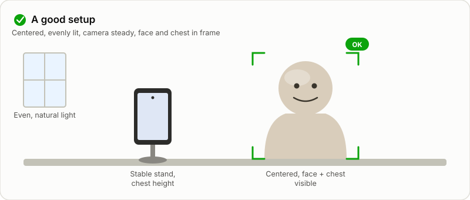
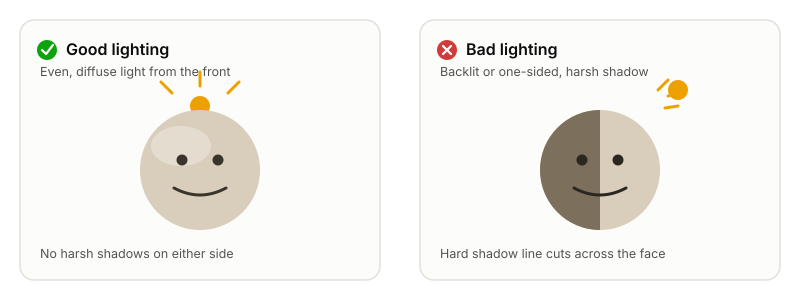
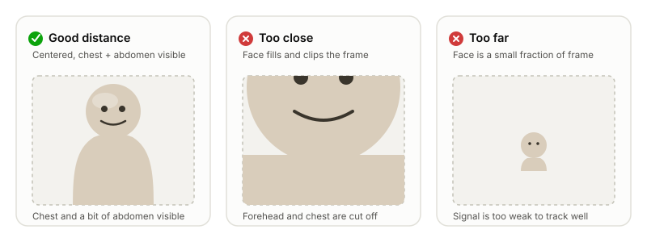
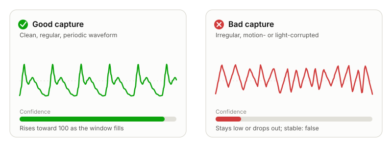

> **Important:** SDK metrics are offered for general wellness and informational purposes only. SDK metrics have not been cleared by the FDA and may not be used for medical diagnosis or treatment.

SmartSpectra estimates pulse, breathing, and related vitals from subtle, per-frame changes in
the camera image: small color shifts in skin caused by blood volume pulse, and small movements
of the chest and abdomen caused by breathing. Because the signal itself is subtle, capture
conditions matter as much as the model — a well-lit, stable, centered shot with an unobstructed
face (and chest, for breathing) will consistently produce high-confidence results, while poor
lighting, motion, or framing will not.

This page is the practical setup guide: what to tell your users, what the SDK tells you back in
real time, and what a good vs. a bad capture looks like. For the precise per-metric operating
ranges and known limitations, see [Model Cards and Limitations](model-cards-and-limitations.md).

## Quick checklist

Point end users at this before their first measurement:

| Condition | Requirement |
| --- | --- |
| **Lighting** | Even, diffuse light on the face. Not too dark, not too bright, no harsh shadows or flicker. |
| **Framing** | One face, centered, roughly facing the camera. For breathing/chest metrics, the chest is also visible. |
| **Distance** | Close enough that the face isn't tiny in frame, far enough that it isn't clipped or overexposed. |
| **Stability** | Camera itself must stay still for breathing/chest metrics. Handheld is fine for pulse, HRV, and blood pressure waveform only. |
| **Subject motion** | Stay still. Avoid talking, chewing gum, or large head/body movement during capture. |
| **Clothing** | Avoid all-dark clothing or tight, high-contrast stripes if measuring breathing. |
| **Patience** | Some metrics need a full window before they're trustworthy — see [Confidence and warm-up time](#confidence-and-warm-up-time) below. |



## Set up the environment

### Lighting

Good lighting is the single biggest lever for measurement quality, because the pulse signal is
a very small change in skin color.

**Do:**

- Use even, diffuse light on the face — natural window light or soft indoor lighting both work well.
- Light the face from the front or slightly off-axis, not from directly behind.
- Keep the light source constant. Avoid sources that visibly flicker, such as some fluorescent
  lights, or a TV/monitor providing the primary light on the face.

**Avoid:**

- **Too dark.** Underexposed frames don't carry enough signal, and low light also encourages
  some cameras to automatically lower their frame rate to lengthen exposure — which can trigger
  a frame-rate warning even when the picture "looks" acceptable.
- **Too bright / backlit.** A window or bright light directly behind the subject silhouettes the
  face and blows out the parts of the frame the model needs. Overhead-only lighting that casts
  hard shadows across half the face has the same effect.
- **Uneven lighting.** One side of the face brightly lit and the other in shadow reduces signal
  quality even when the average exposure looks fine.



### Framing and distance

- Exactly **one** face should be in frame. Multiple faces, or no face at all, both block
  processing.
- The face should be roughly orthogonal to the camera — a face turned far to the side or tilted
  away doesn't track reliably.
- The face shouldn't be so close that it's clipped or fills the whole frame, or so far away that
  it's a small fraction of the image.
- For breathing and chest-based metrics, the upper chest also needs to be visible and
  unobstructed; the lower abdominal breathing waveform additionally needs the waistline visible.



### Camera stability

Stability requirements differ by metric:

- **Pulse rate, HRV, and the arterial pressure waveform** tolerate a handheld camera as long as
  it's relatively stable — small hand shake is fine.
- **Breathing rate and the chest/abdomen waveforms** need the camera itself to be stationary
  (e.g., propped on a stand, table, or dock). Handheld capture defeats breathing measurement
  because chest-motion tracking can't distinguish camera motion from breathing motion.

If your app supports both, default to a stable mount so the same session can measure everything
requested.

### Subject stillness and behavior

- The subject should sit still — large head, body, or camera motion produces unreliable readings
  with deceptively high confidence, so it's worth coaching users explicitly rather than relying
  on the SDK to catch every case.
- Avoid talking during a breathing measurement; speech changes chest/abdomen motion in ways that
  don't reflect the breathing signal.
- Avoid chewing gum during pulse, HRV, or blood-pressure-waveform measurement.

### Clothing (breathing)

Dark clothing absorbs light needed to track subtle chest motion, and tight, high-contrast striped
patterns can alias against the camera's pixel grid and get misread as motion. Prefer plain,
lighter-colored clothing for breathing measurements.

### Frame rate

The on-device pipeline needs a sustained camera frame rate — don't let the camera fall below
roughly **25 fps**; target 30 fps for headroom. This is usually automatic on modern devices, but
two things can undermine it:

- Low light, which can cause the camera's auto-exposure to lengthen exposure time and drop frame
  rate to compensate — another reason to fix lighting first if you see intermittent frame-rate
  warnings.
- Heavy on-device CPU/GPU contention from other work happening at the same time as capture.

## Confidence and warm-up time

Every rate-based metric ships with a `confidence` value (0–100) and a `stable` flag alongside the
value itself — treat both as part of the reading, not just the number:

- **Confidence starts at 0** and only becomes meaningful once the metric's analysis window has
  filled: 30 seconds for breathing rate and the breathing waveforms, 60 seconds for HRV, 12
  seconds for pulse rate. Don't surface or act on a reading before its window has elapsed —
  early "0 confidence" samples are expected, not a bug.
- **`stable`** indicates whether the underlying detection (face, landmarks, etc.) is currently
  reliable frame-to-frame. Treat `stable: false` the same way you'd treat a validation warning:
  something in the capture (framing, motion, lighting) is currently degraded.

See [Data Types](data-types.md) for the full payload schema.

## Reading the SDK's live feedback

The SDK continuously evaluates the incoming frames and reports a `ValidationStatus` — a stable
`code` plus a human-readable `hint` string — so you don't have to guess why a measurement looks
bad. Surface the `hint` text directly to end users; it's designed to be shown as-is.

| Code | Meaning | What to tell the user |
| --- | --- | --- |
| `OK` | Frame passes all checks. | Nothing — this is the "good" state. |
| `NO_FACE_FOUND` | No face detected in frame. | Get a face into frame, facing the camera. |
| `MULTIPLE_FACES_FOUND` | More than one face detected. | Make sure only one person is in frame. |
| `FACE_NOT_CENTERED` | Face detected but off-center horizontally (left/right). | Center your face in the frame. |
| `TOO_DARK` | Image is underexposed. | Add light, or move to a brighter area. |
| `TOO_BRIGHT` | Image is overexposed. | Reduce light, or move away from a bright/backlit source. |
| `CHEST_NOT_VISIBLE` | Chest not visible or too far away (breathing/chest metrics). | Reframe so the upper chest is visible. |
| `CAMERA_TUNING` | Camera is still auto-adjusting exposure/focus. | Wait a moment before recording. |
| `FRAME_RATE_TOO_LOW` | Sustained camera frame rate has dropped too low. | Improve lighting (see above) or reduce concurrent device load. |
| `EXCESSIVE_MOTION` | Body or head motion exceeds the reliable-measurement threshold. | Hold still — motion may affect accuracy. |
| `FACE_TOO_CLOSE` | Face fills too much of the frame. | Move away from the camera. |
| `FACE_TOO_FAR` | Face is smaller than the minimum usable size. | Move closer to the camera. |
| `FACE_TOO_HIGH` | Face is too high in the frame (off-center vertically). | Move down, or tilt the camera up. |
| `FACE_TOO_LOW` | Face is too low in the frame (off-center vertically). | Move up, or tilt the camera down. |

This is the same enum across platforms — Swift's `ValidationCode`, Kotlin's `ValidationCode`,
C++'s `spectra::ValidationCode`, and the Node client's `ValidationCodeValue` all carry the same
codes and wire values.

**Swift:**

```swift
// sdk.validationStatus is an @Observable property: (code, hint)
guard let validationStatus = sdk.validationStatus else { return }
statusLabel.text = validationStatus.hint
```

**Kotlin:**

```kotlin
sdk.validationStatus.observe(this) { status ->
    validationLabel.text = status?.hint ?: "--"
}
```

**C++:**

```cpp
sdk.SetOnValidationStatusChanged(
    [](const spectra::ValidationStatus& status, int64_t timestamp_us) {
      std::cerr << "Validation: " << status.hint << "\n";
    });
```

**TypeScript:**

```typescript
sdk.on('validationStatus', (code, timestampUs, hint) => {
  showBanner(hint);
});
```

> **Tip:** Debounce or coalesce repeated identical statuses before showing them — a stationary,
> well-positioned subject can still flicker between `OK` and a borderline code frame-to-frame.
> Update the UI only when the code actually changes.

## What good vs. bad looks like



A good pulse or breathing trace looks like a clean, regular, periodic waveform — smoothly
repeating peaks roughly in line with a plausible heart or breathing rate, with confidence rising
toward 100 as the analysis window fills. A bad trace is irregular and jagged, with no consistent
periodicity, confidence that stays low or drops out, and `stable: false` or a non-`OK`
`ValidationStatus` during the affected stretch. If a trace looks noisy, check the underlying
cause first — camera motion, subject motion, poor lighting, or a partially occluded face/chest —
rather than assuming the reading is a valid-but-unusual result. See
[Model Cards and Limitations](model-cards-and-limitations.md) for the exact operating range and
"works when / does not work when" conditions for each metric.

## Guidance to give your end users

The setup guidance above translates directly into a short in-app tutorial. A concrete example
(adapted from the SmartSpectra sample apps):

1. Place your device on a stable surface, like a table or stand.
2. Use a well-lit environment — natural daylight works best.
3. Make sure your face is evenly lit with no strong shadows.
4. Avoid bright light sources directly behind you, such as a window or overhead light.
5. Stay still and avoid talking during the measurement.
6. Watch for on-screen feedback — it tells you exactly what to fix if something's off.
7. Start recording when prompted, and follow any auto-restart prompts if feedback appears mid-measurement.

## Related reading

- [Model Cards and Limitations](model-cards-and-limitations.md) — per-metric valid ranges, "works
  when" / "does not work when" conditions, and links to the full model cards.
- [Data Types](data-types.md) — the `Measurement`, `MeasurementWithConfidence`, and
  `ValidationStatus` payload schema.
