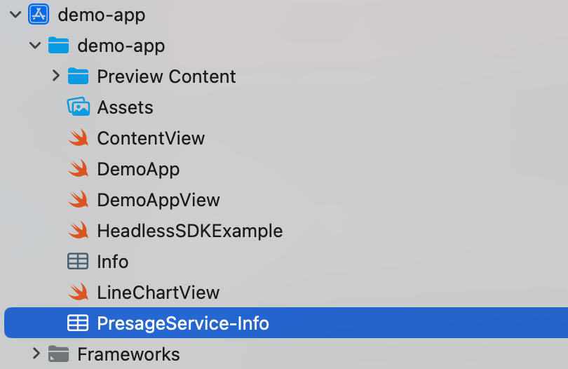

# iOS Troubleshooting

## Installation & Setup

### Package not found in Xcode

Ensure you're adding the package via **File → Add Package Dependencies...**, entering `https://github.com/Presage-Security/SmartSpectra-Swift`, and selecting the latest stable tag (`3.3.0` at time of writing) for repeatable builds. Pin the current release rather than an older one — the [migration guide](migration-guide.md) documents behaviour changes since 3.0. Use **Branch → main** only when testing the latest final public release before pinning a version.

If you pasted a subdirectory URL such as `/tree/main/swift/sdk`, replace it with the repository root URL above. Swift Package Manager resolves the package from the repo root.

---

### Measurement does not start on the simulator

The simulator has no camera, so camera-driven measurement needs a physical device.
Select a real device target in Xcode for normal development.

The simulator supports supplied video frames through public
[`useCustomInput()`](headless-mode.md#use-your-own-camera-or-video-source),
or the testing-only file-playback API — see
[Headless testing in CI](headless-testing-in-ci.md), which runs a full measurement on
the iOS Simulator.

---

## Camera & Permissions

### `NSCameraUsageDescription` missing

This key is required when your app opens a camera, including SDK-owned capture.
Custom input does not check or request camera access; a decoder-only integration
does not need camera permission. Your own camera capture still needs it.

In Xcode:

1. Select your app target.
2. Open the `Info` tab.
3. Add a new row for `Privacy - Camera Usage Description`.
4. Set the value to `This app needs camera access to measure vitals.`

With SDK-owned capture, the SDK fails gracefully if this key is absent or empty.

Or add the entry directly to your `Info.plist`:

```xml
<key>NSCameraUsageDescription</key>
<string>This app needs camera access to measure vitals.</string>
```

---

### Camera permission denied at runtime

For SDK-owned capture, the reference sample offers an action to open iOS Settings
when camera permission is denied. With custom input, your app handles permission
for its own capture source. Ensure your `Info.plist` description explains why
your app needs camera access.

---

## Authentication

### Auth errors / measurements not starting

1. Verify your API key is correct, or that your OAuth plist is present and valid.
2. Ensure the device has an active internet connection.
3. Check that the key or app registration is active in [physiology.presagetech.com](https://physiology.presagetech.com/auth/login).

If processing fails immediately with a missing-auth error, make sure you set `sdk.config.apiKey = "YOUR_KEY"` before calling `try await SmartSpectraSDK.shared.start()`.

---

### OAuth not working

When registering your OAuth app, enter the app target's Bundle Identifier exactly as Xcode shows it, including capitalization. Enter your **Apple Org ID** (Team ID, e.g. `AB12CDE34F`) for the Organization ID: exactly 10 uppercase alphanumeric characters, not a certificate fingerprint. Find it in **Xcode → Settings → Accounts**, select your Apple ID and team, and read the `Team ID` value — or in your [Apple Developer Account](https://developer.apple.com) under `Membership Details`.

Place the downloaded `PresageService-Info.plist` in your app, enable its app-target membership, and add the **App Attest** capability under the target's `Signing & Capabilities` tab. Run on a supported physical iOS or iPadOS device and confirm `DCAppAttestService.shared.isSupported` is `true`; the simulator cannot create an App Attest identity.

The plist must set `IS_OAUTH_ENABLED` to `true` and contain non-blank string values for `CLIENT_ID` and `SUB`. `BUNDLE_ID`, when present, must exactly match the running app target's Bundle Identifier; older plists without `BUNDLE_ID` skip the local check and rely on the server's verification. An invalid field or mismatch produces a non-retryable `configurationFailed` error as soon as the SDK loads, before any authentication network request. The error message identifies the invalid field or mismatch without exposing its value.

Portal sandbox behavior controls which App Attest identities the server accepts:

- Enabled: accepts development identities from locally signed builds and production identities from TestFlight or the App Store.
- Disabled: accepts production identities only.

Your app repo should look roughly like this:



> **Note:** Each bundle identifier can only be registered once. You cannot create multiple OAuth configs for the same bundle ID.

---

## Metrics & Data

### Pulse rate / cardio metrics not appearing

Breathing metrics are enabled by default. Cardio metrics are not. Enable them explicitly:

```swift
let sdk = SmartSpectraSDK.shared

sdk.config.requestedMetrics = SmartSpectraConfig.breathingMetrics + SmartSpectraConfig.cardioMetrics
// or
sdk.config.requestedMetrics = [
    .breathingRate,
    .pulseRate,
    .hrv
]
```

---

### `metricsBuffer` / `$metricsBuffer` unresolved

`MetricsBuffer` was removed. Replace `metricsBuffer` with `sdk.metrics`.
The SDK now uses Swift Observation, so Combine-style `$` publishers such as
`sdk.$metrics` are no longer available.

```swift
// Before
sdk.$metricsBuffer.sink { buffer in
    let pulse = buffer?.pulse.rate.last?.value
}

// After in SwiftUI
if let metrics = sdk.metrics {
    let pulse = metrics.cardio.pulseRate.last?.value
}
```

SwiftUI views automatically track reads of `sdk.metrics`. For UIKit or other
non-SwiftUI code, observe SDK properties with `withObservationTracking` and
re-arm the observation after each change.

Field mapping:

| Old (`metricsBuffer`) | New (`metrics`) |
| --- | --- |
| `pulse.rate` | `cardio.pulseRate` |
| `pulse.trace` | `cardio.arterialPressureTrace` |
| `breathing.rate` | `breathing.rate` |
| `breathing.upperTrace` | `breathing.upperTrace` |

> **Important:** Cardio fields now require cardio metrics to be requested explicitly, for example through `requestedMetrics`. Previously, `MetricsBuffer` provided pulse rate regardless of configuration.

---

## Headless Mode

### Custom input stays in `.starting`

Await `sdk.start()`, then begin submitting frames. Do not wait for
`processingStatus == .running` before sending the first frame. An accepted
frame is not a completed measurement; continue observing `sdk.metrics`,
`sdk.validationStatus`, and `sdk.error`.

### Custom frames are rejected

Inspect the `SmartSpectraError` in `FrameSubmissionResult.rejected`:

| Code | What to check |
| --- | --- |
| `.invalidState` | Await start before sending. Stop before selecting a source. A replaced input handle cannot be reused. |
| `.frameConversionFailed` | Supply BGRA or 8-bit bi-planar NV12 with even dimensions for NV12. Sample buffers must contain ready, uncompressed pixels. |
| `.nonMonotonicTimestamp` | Use finite, nonnegative, strictly increasing microsecond timestamps below `Int64.max - 2`. Sample buffers use their presentation timestamps. |
| `.timestampGap` | Stop and start after a gap over two seconds; do not rewrite live capture timestamps to conceal an interruption. |

Keep pixels alive and unchanged until submission returns. Supply upright pixels
or select a fixed `FrameTransform`; the SDK does not infer sample orientation
from metadata. See [custom input](headless-mode.md#use-your-own-camera-or-video-source)
for supported layouts and lifecycle details.

### `processingStatus` cases don't match

`SmartSpectraSDK.processingStatus` uses the current lifecycle states. Update any `switch` or comparisons:

| Old case | New case |
| --- | --- |
| `.processing` | `.running` |
| `.processed` | `.idle` |
| `.idle` | `.idle` |
| `.starting` | `.starting` |
| `.stopping` | `.stopping` |
| `.error` | `.error` |

---

### `startProcessing()` / `stopProcessing()` unresolved or inaccessible

`SmartSpectraVitalsProcessor` is no longer part of the public Swift API. Use the async lifecycle methods on `SmartSpectraSDK.shared`:

```swift
do {
    try await SmartSpectraSDK.shared.start()

    // Observe SmartSpectraSDK.shared.metrics,
    // SmartSpectraSDK.shared.processingStatus,
    // SmartSpectraSDK.shared.validationStatus, etc.

    try await SmartSpectraSDK.shared.stop()
} catch {
    print("SmartSpectra error: \(error)")
}
```

For older-to-current mappings, see the [iOS Migration Guide](migration-guide.md).

---

## Getting Help

- Email: [support@presagetech.com](mailto:support@presagetech.com)
- [Submit a GitHub issue](https://github.com/Presage-Security/SmartSpectra-Swift/issues)
- API reference: [Swift API reference](api-reference.md)
